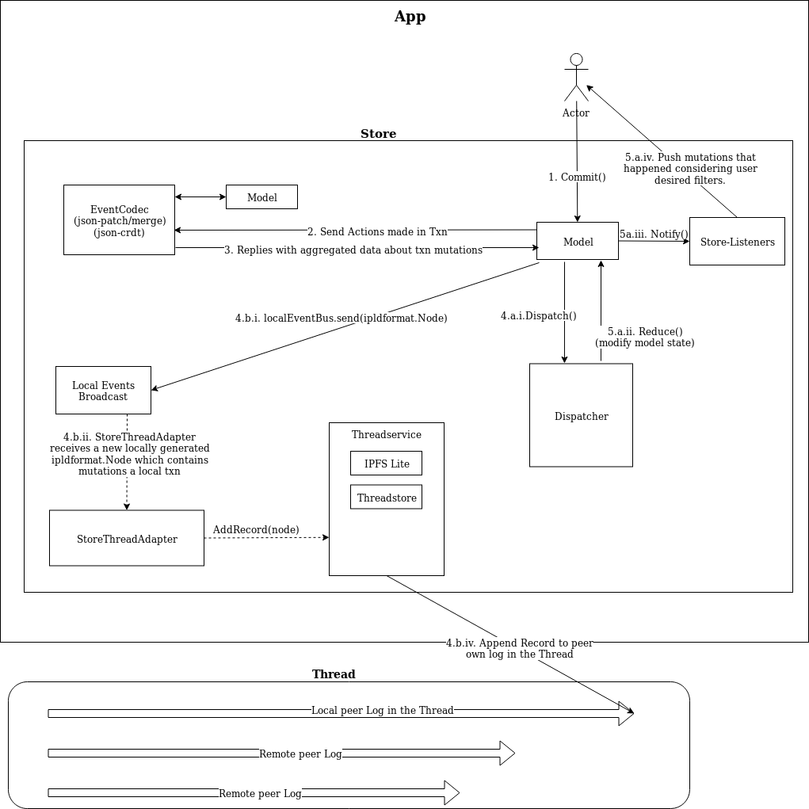

# DB
`DB` is a json-document database backed by Threads V2.

This document describes its public API, and its internal design/architecture. 
Internal understanding isn't necessary to use `DB`, but will help understand 
how things are wired. Creating a `DB` under the default configuration will 
automatically build everything required to work.

Currently, a `DB` is backed by a single Thread. In the future, this can 
change making the `DB` map different `Collection`s to different Threads, or 
any other combination.

## Usage
ToDo: Describe public API here.

## Internal Design
In this section, there is a high-level overview of internal `DB` design.

### Diagram
The following diagram try to express all components and their relationships and 
communications:

The above diagram depicts the different components inside a `DB`. Also, it 
travels through their relationships caused by a transaction commit. The inverse 
path, caused by a new event detected in other peer log in the thread, is 
somewhat similar but in the other direction.

Arrows aren't always synchronous calls, but also channel notifications and 
other mediums in order to inverse dependency between components. Arrows are 
conceptual communications.

#### Collections
Collections are part of `DB` public-api.
Main responsibility: store instances of a user-defined schema.

Collections are json-schemas that describe instance types of the `DB`. They 
provide the public API for creating, deleting, updating, and querying instances 
within this collection. They also provide read/write transactions which have 
_serializable isolation_ within the `DB` scope.

*Indexes*

Collections support indexes for faster queries on schema-defined fields. When registering
a new schema (and defining a Collection), a caller may supply a list of field paths to
index on. This creates an Index, which can be used to speed up queries at the expense
of additional storage and compute on instance creation and updates. For dbs with
a small number of instances, it may not be worth the added overhead, so as always
avoid optimizing your queries until you need it!

Insertion with indexes costs approximately twice as much as without (depending on the
complexity and frequency of a given index), whereas updates are only slightly more
costly (almost identical in most cases). Depending on the underlying data distribution,
queries can be greater than an order of magnitude faster. This depends on many factors,
including the size of the db (i.e., number of instances), the uniqueness of the
indexed field, and the complexity of the query. For example, in our benchmark tests
using a relatively simple Collection and a relatively small db size (i.e., ~5000
instances), the query speedup for a simple OR-based equality test is ~10x. See
`db/bench_test.go` for details or to run the benchmarks yourself.

#### EventCodec
This is an internal component not available in the public API.
Main responsibility: Transform and apply and encode/decode transaction actions.

`EventCodec` is an abstraction used to:
- Transform actions made in a txn, to an array of `db.Event` that will be 
dispatcher to be reduced.
- Encode actions made in a txn to a `format.Node` which will serve as 
the next building block for the appended Record in the local peer log.
- The reverse of last point, when receiving external actions to allow to be 
dispatched.

For example, if within a collection `WriteTxn()`, a new instance is created and 
other was updated, these two action will be sent to the `EventCodec` to 
transform them in `Event`s. These `Event` have a byte payload with the encoded 
transformation. Currently, the only implementation of `EventCodec` is a 
`jsonpatcher`, which transforms these actions in json-merge/patches, and store 
them as payloads in events. 

These events are also aggregated in a returned `format.Node`, which is the 
compatible/analogous information to be used by `net.Net` to add in 
the peer own log in the thread associated with the `DB`. Likewise, 
`EventCodec` also do the inverse transformation.  Given a `format.Node`, it 
transforms its byte payload into actions that will be reduced in the db.

The `EventCodec` abstraction allows an extensibility point. If instead of a 
json-patcher we want to encode instance changes as full instance snapshots 
(i.e: instead of generating the json-patch, let generate the full instance 
data), we could provide another implementation of the `EventCodec` to use in 
the DB.

Similarly, more advanced encodings of JSON-Document changes can be implemented 
as `EventCodec` such as JSON-Documents-Delta-CRDTs, or a hybrid json-patch 
with logical clocks.

#### Dispatcher
This is an internal component not available in the public API.
Main responsibility: Source of truth regarding known `db.Event`s for the 
`DB`. Will notify registered parties to let them know about new ones.

Every `Event` generated in the `DB` is sent to a `Dispatcher` when write 
transactions are committed. The dispatcher is responsible for broadcasting 
these events to all registered Reducers. A reducer is a party which is 
interested in knowing about `DB` events. Currently, the only reducer is the 
`DB` itself.

For example, if a particular instance is updated in a `Collection`, these 
corresponding actions will be encoded as `Event` by the `EventCodec` as 
mentioned in the last section. These `Events` will be dispatched to the 
`Dispatcher`, which will:
- Store the new event in durable storage. If the txn made multiple changes, 
this is done transactionally.
- Broadcast them to all registered Reducers (which currently is only `DB`). 
Reducers will apply those changes for their own interests.

The implications of this design imply that real `DB` state changes can 
only happen when the `Dispatcher` broadcast new `db.Event`s. 
A `Reducer` can't distinguish between `Events` generated locally or externally. 
External events are the results of `net.Net` sending new events to the 
`Dispatcher`, which means that new `Event`s where detected in other peer logs 
of the same Thread.

#### Datastore
This is an internal component not available in the public API.
Main responsibility: Delivering durable persistence for data.

`Datastore` is the underlying persistence of ``Collection`` instances and 
`Dispatcher` raw `Event` information. In both cases, their interface is a 
`datastore.TxnDatastore` to have txn guarantees.

#### Local Event Bus
This is an internal component not available in the public API.
Main responsibility: Deliver `format.Node` encoded information of changes 
done in local committed transactions. Currently, only to `SingleThreadAdapter` 
is listening to this bus. 

#### DB Listener
This is part of the public-api. 
Main responsibility: Notify external actors that the `DB` changed its state, 
with details about the change: in which collection, what action (Create, Save, 
Delete), and wich InstanceID.

Listeners are useful for clients that want to be notified about changes in the 
`DB`. Recall that `DB` state can change by external events, such as 
receiving external changes from other peers sharing the `DB`.

The client can configure which kind of events wants to be notified. Can add 
any number of criterias; if more than one criteria is used they will be 
interpreted as _OR_ conditions.
A criteria contains the following information:
- Which collection to listen changes
- What action is done (Create, Save, Delete)
- Which InstanceID

Any of the above three attributes can be set empty. For example, we can listen 
to all changes of all instances in a collection if only the first attribute is set 
and the other two are left empty/default.

### DBThreadAdapter (SingleThreadAdapter, unique implementation)
This is an internal component not available in the public API.
Main responsibility: Responsible to be the two-way communication between 
`DB` and `Threads`.

Every time a new local `format.Node` is generated in the `DB` due to a 
write transaction commit, the `DBThreadAdapter` will notify `net.Net` 
that a new `Record` should be added to the local peer log.

Similarly, when `net.Net` detects new `Record`s in other peer logs, it 
will dispatch them to `SingleThreadAdapter`. Then, it will transform it into a 
DB `Event`s that will be dispatched to `Dispatcher` and ultimately will 
be reduced to impact `DB` state.

As said initially, currently, the `DB` is only mapped to a single Thread. 
But is possible to decide a different map, where a `DB` might be backed by 
more than one thread or any other schema. This is the component that should 
be taking this decisions.

### net.Net
This component is part of the public-api so that it can be accessed.
Main responsibility: Is the `DB` interface with Threads layer.

`net.Net` is the bidirectional communication interface to the underlying 
Thread backing the `DB`. It only interacts with `DBThreadAdapter`

